# YinQing Agent 详细架构文档

## 目录

1. [项目概述](#1-项目概述)
2. [系统架构总览](#2-系统架构总览)
3. [核心组件详解](#3-核心组件详解)
4. [数据流与执行流程](#4-数据流与执行流程)
5. [协议与通信](#5-协议与通信)
6. [改进方案：审核Agent与流程回溯](#6-改进方案审核agent与流程回溯)
7. [部署与运维](#7-部署与运维)

---

## 1. 项目概述

### 1.1 项目定位

YinQing Agent 是一个**企业级通用智能Agent编排器**，采用分层微服务架构，整合了：

- **LLM (Google Gemini)** - 智能任务理解与拆解
- **MCP (Model Context Protocol)** - Agent能力发现与注册
- **A2A (Agent-to-Agent)** - 标准化的Agent间通信协议

核心能力是将复杂的自然语言任务智能拆解为**有向无环图（DAG）任务链**，并通过动态Agent发现与并行调度引擎高效执行。

### 1.2 核心特性

| 特性 | 描述 |
|------|------|
| 智能任务拆解 | LLM自动理解用户意图，生成结构化执行计划 |
| DAG并行调度 | 拓扑排序 + 异步并发，最大化执行效率 |
| 动态Agent发现 | 通过MCP协议实时发现和匹配Agent能力 |
| 上下文传递 | 步骤间智能传递执行结果，支持复杂依赖 |
| 流式输出 | 实时反馈执行进度，支持前端集成 |
| 结果归档 | 自动保存Markdown报告，支持追溯 |

### 1.3 技术栈

```
┌─────────────────────────────────────────────────────────────┐
│                    应用层 (Application)                      │
│  Click CLI · Rich Logger · Markdown Output                  │
├─────────────────────────────────────────────────────────────┤
│                    编排层 (Orchestration)                    │
│  WorkflowEngine · DAG Scheduler · Context Manager           │
├─────────────────────────────────────────────────────────────┤
│                    智能层 (Intelligence)                     │
│  TaskParser (Gemini LLM) · CapabilityMatcher · Executor     │
├─────────────────────────────────────────────────────────────┤
│                    协议层 (Protocol)                         │
│  MCP Client (SSE/STDIO) · A2A SDK · HTTP/JSON               │
├─────────────────────────────────────────────────────────────┤
│                    基础设施 (Infrastructure)                 │
│  asyncio · httpx · Pydantic · Starlette · Uvicorn           │
└─────────────────────────────────────────────────────────────┘
```

---

## 2. 系统架构总览

### 2.1 高层架构图

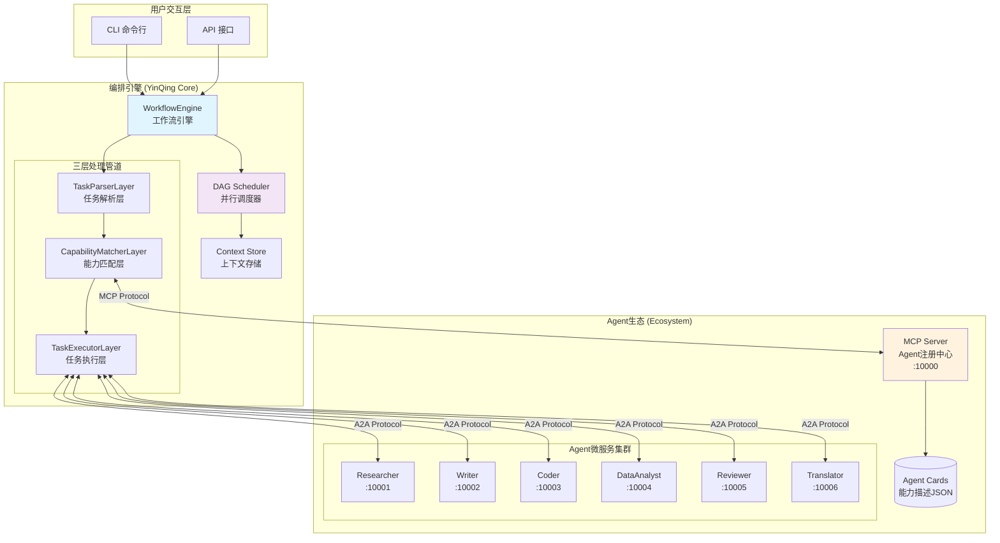

### 2.2 目录结构

```
YinQing_Agent/
├── src/yinqing/                    # 核心编排引擎
│   ├── core/
│   │   ├── types.py               # 数据模型定义
│   │   ├── parser.py              # 任务解析层
│   │   ├── matcher.py             # 能力匹配层
│   │   ├── executor.py            # 任务执行层
│   │   ├── workflow.py            # 编排引擎核心
│   │   └── mcp_client.py          # MCP客户端
│   ├── utils/
│   │   ├── logger.py              # 日志配置
│   │   ├── config.py              # 环境配置
│   │   └── common.py              # 工具函数
│   └── main.py                    # CLI入口
│
├── real_ecosystem/                 # Agent生态
│   ├── mcp_server/
│   │   └── server.py              # MCP注册服务
│   ├── agents/                    # Agent实现
│   │   ├── researcher.py
│   │   ├── writer.py
│   │   ├── coder.py
│   │   ├── data_analyst.py
│   │   ├── reviewer.py
│   │   └── translator.py
│   └── cards/                     # Agent能力卡片
│
├── output/                        # 执行结果归档
├── .env                           # 环境变量
└── start_real_agents.sh           # 启动脚本
```

---

## 3. 核心组件详解

### 3.1 数据模型 (types.py)

#### TaskStep - 任务步骤

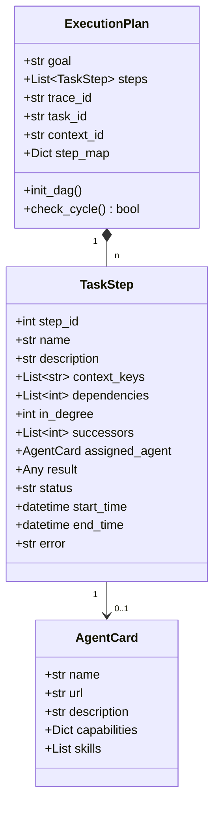

#### 状态流转

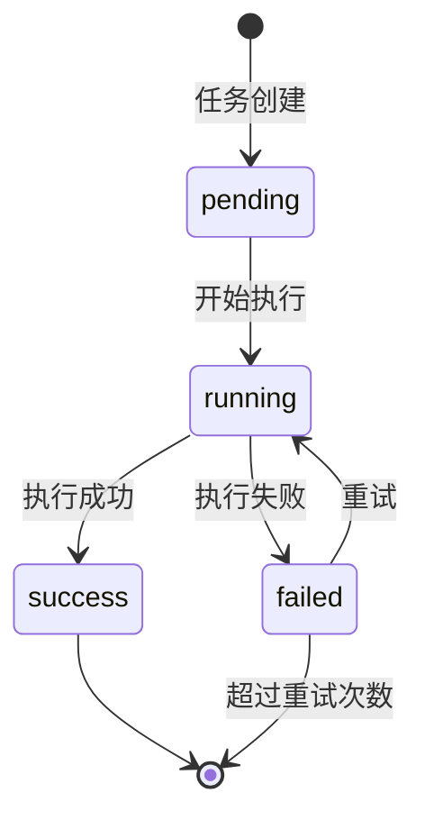

### 3.2 任务解析层 (parser.py)

负责将自然语言任务转化为结构化的执行计划。

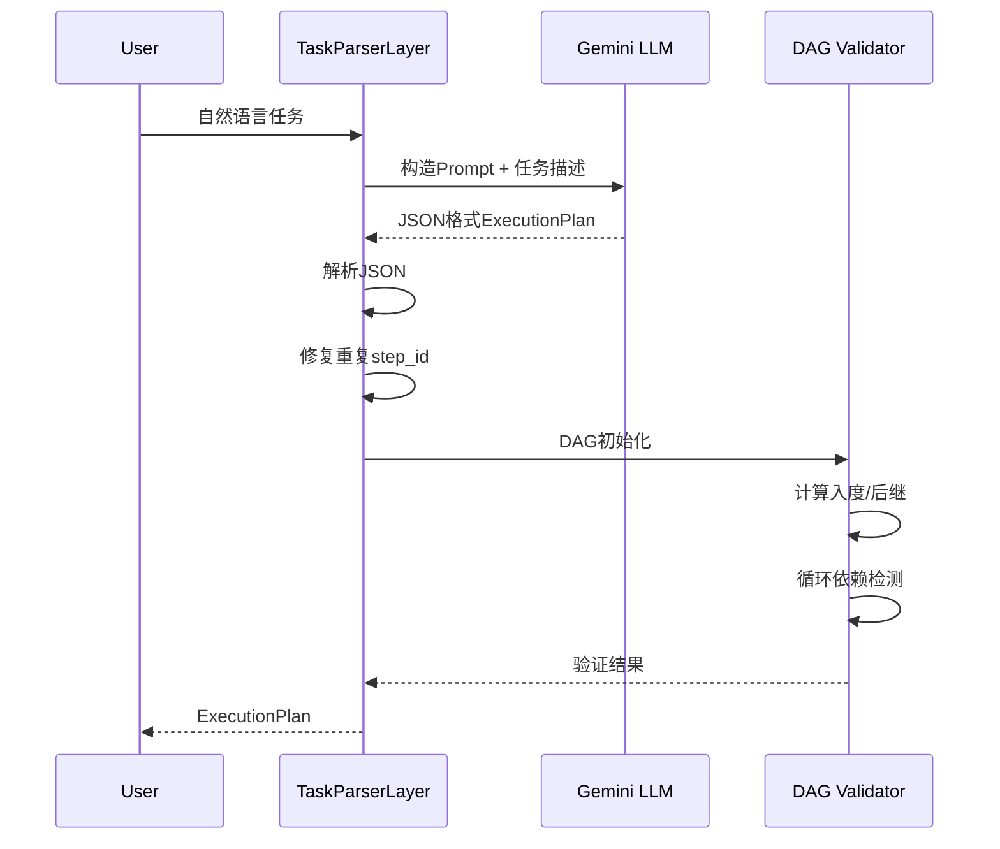

**Prompt设计要点**：
- 明确支持并行依赖的指导
- 要求3-10个步骤的合理粒度
- 强制避免循环依赖
- 输出格式为严格JSON

### 3.3 能力匹配层 (matcher.py)

为每个任务步骤找到最合适的Agent执行者。

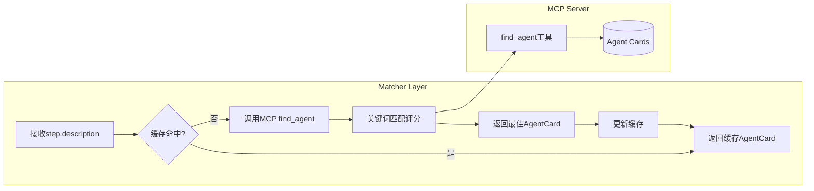

**缓存策略**：
- LRU缓存 + TTL (10分钟)
- Key: step.description的hash
- 减少网络往返，提升性能

### 3.4 任务执行层 (executor.py)

与具体Agent的HTTP通信层。

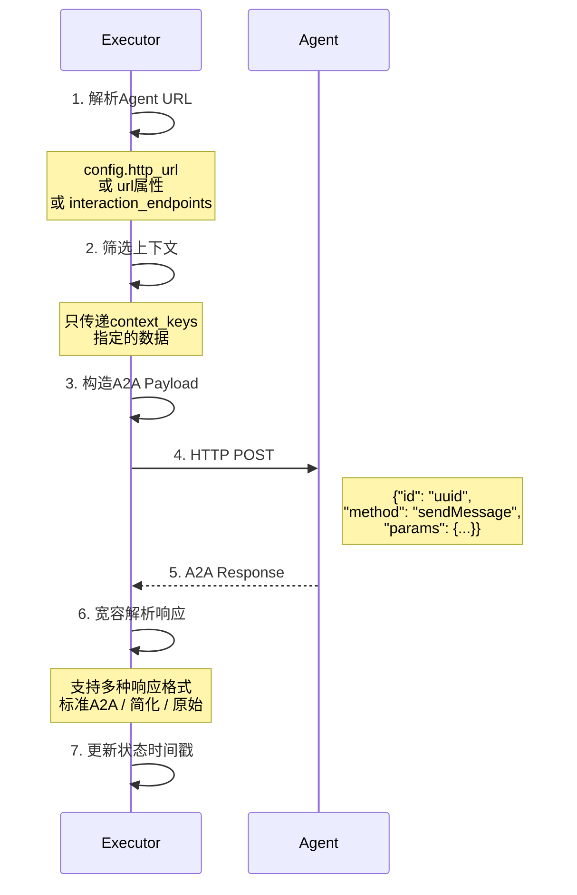

### 3.5 编排引擎 (workflow.py)

核心调度逻辑，实现DAG并行执行。

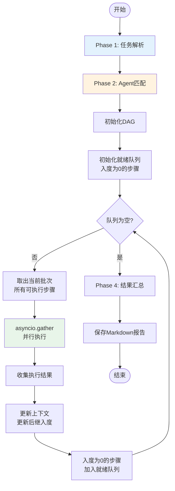

---

## 4. 数据流与执行流程

### 4.1 完整执行流程示例

**用户输入**：
```
"分析Python、Java和Go三种编程语言的优缺点，并写一份对比总结报告"
```

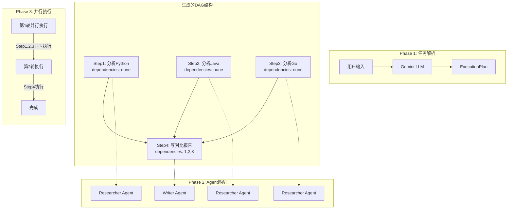

### 4.2 上下文传递机制

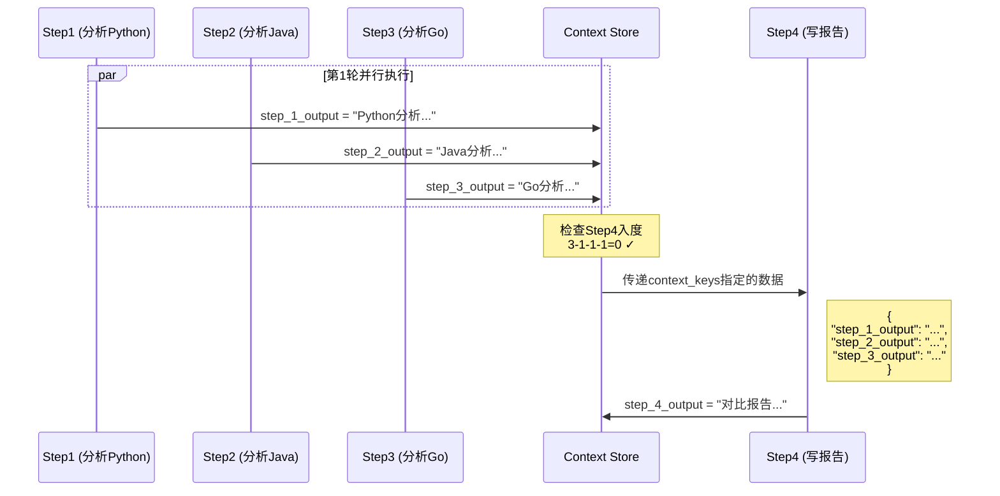

### 4.3 并行调度时序

```mermaid
gantt
    title DAG并行执行时序
    dateFormat X
    axisFormat %s

    section 第1轮
    Step1-分析Python    :a1, 0, 3
    Step2-分析Java      :a2, 0, 4
    Step3-分析Go        :a3, 0, 3

    section 第2轮
    Step4-写报告        :a4, after a2, 5
```

---

## 5. 协议与通信

### 5.1 MCP协议集成

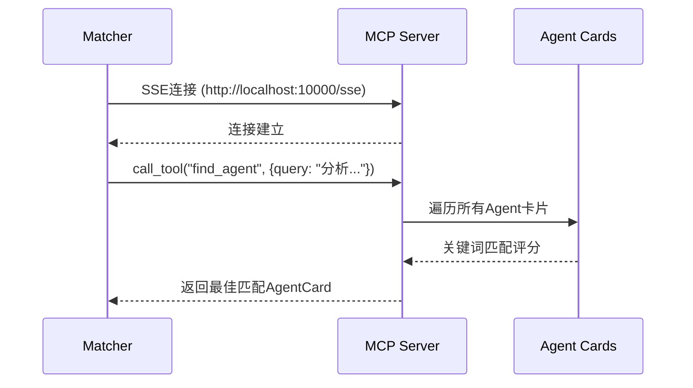

### 5.2 A2A协议通信

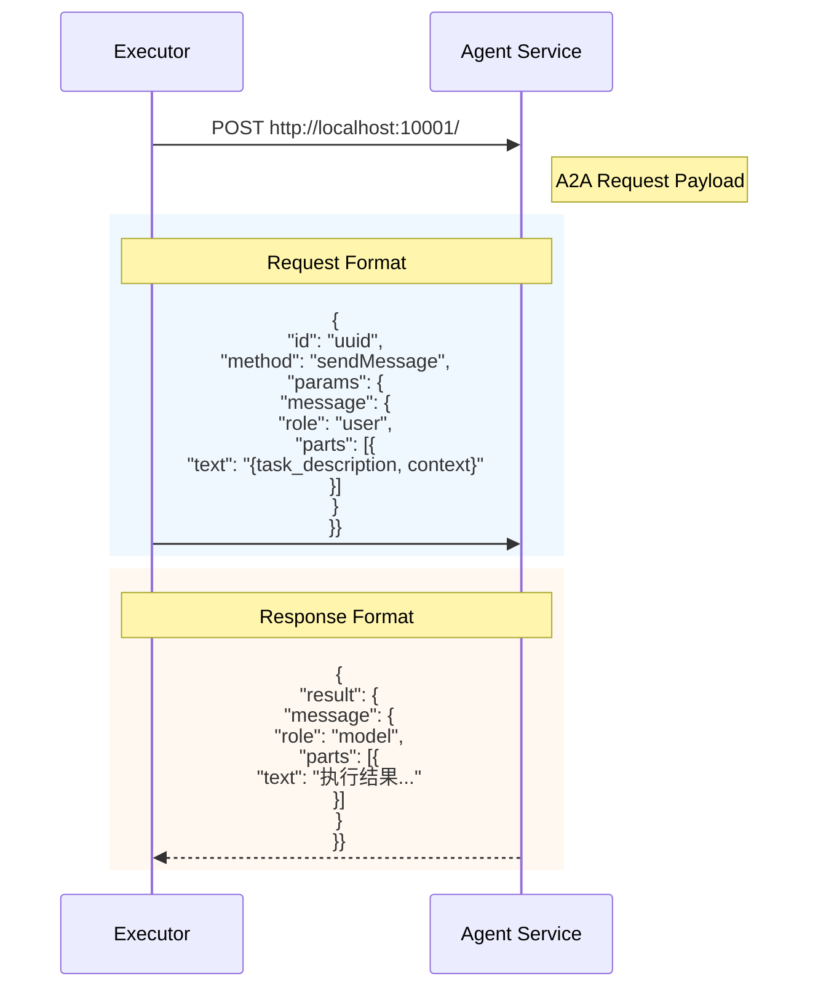

### 5.3 端口分配

```
┌─────────────────────────────────────────────────┐
│              Port Allocation                     │
├─────────────────────────────────────────────────┤
│  10000  │  MCP Server (Agent Registry)          │
│  10001  │  Researcher Agent                      │
│  10002  │  Writer Agent                          │
│  10003  │  Coder Agent                           │
│  10004  │  Data Analyst Agent                    │
│  10005  │  Reviewer Agent                        │
│  10006  │  Translator Agent                      │
└─────────────────────────────────────────────────┘
```

---

## 6. 改进方案：审核Agent与流程回溯

### 6.1 问题分析

当前系统的局限性：
1. **单向执行**：任务执行后无法回退或修正
2. **缺乏质量把控**：没有审核机制验证执行结果
3. **无法迭代优化**：发现问题需要重新执行整个流程

### 6.2 改进架构设计

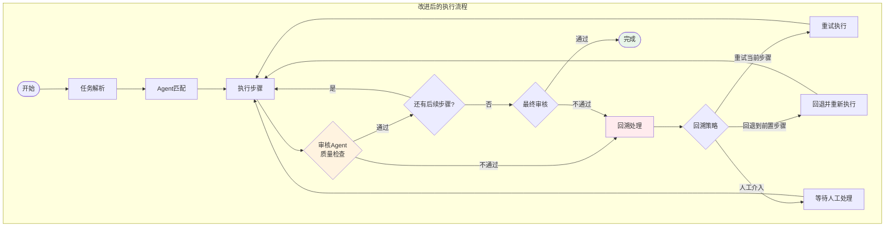

### 6.3 审核Agent设计

#### 6.3.1 审核Agent卡片

```json
{
  "name": "Quality Reviewer Agent",
  "description": "专业的质量审核Agent，负责检查其他Agent的输出质量，提供改进建议",
  "version": "1.0.0",
  "url": "http://localhost:10007",
  "capabilities": {
    "streaming": true,
    "review": true,
    "rollback_suggestion": true
  },
  "skills": [
    {
      "id": "quality_check",
      "name": "Quality Check",
      "description": "检查执行结果的质量、完整性和准确性",
      "tags": ["review", "quality", "check", "validate", "审核"]
    },
    {
      "id": "rollback_analysis",
      "name": "Rollback Analysis",
      "description": "分析问题原因，提供回溯建议",
      "tags": ["rollback", "analysis", "improvement", "回溯"]
    }
  ]
}
```

#### 6.3.2 审核结果数据模型

```python
class ReviewResult(BaseModel):
    """审核结果"""
    step_id: int                           # 被审核的步骤ID
    passed: bool                           # 是否通过审核
    score: float                           # 质量评分 0-1
    issues: List[str]                      # 发现的问题列表
    suggestions: List[str]                 # 改进建议
    rollback_recommendation: Optional[RollbackAction]  # 回溯建议

class RollbackAction(BaseModel):
    """回溯动作"""
    action_type: Literal["retry", "revert", "human_intervention"]
    target_step_id: int                    # 目标步骤ID
    reason: str                            # 回溯原因
    modified_context: Optional[Dict]       # 修改后的上下文（如有）
    max_retries: int = 3                   # 最大重试次数
```

### 6.4 流程回溯机制

#### 6.4.1 状态快照与恢复

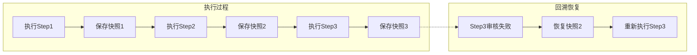

#### 6.4.2 快照数据结构

```python
class ExecutionSnapshot(BaseModel):
    """执行快照"""
    snapshot_id: str
    timestamp: datetime
    trace_id: str
    step_id: int                           # 快照对应的步骤

    # 状态数据
    global_context: Dict[str, Any]         # 全局上下文副本
    step_states: Dict[int, StepState]      # 所有步骤状态

    # DAG状态
    in_degrees: Dict[int, int]             # 入度状态
    completed_steps: List[int]             # 已完成步骤

    def restore(self) -> ExecutionPlan:
        """恢复到此快照状态"""
        pass

class StepState(BaseModel):
    """步骤状态"""
    status: str
    result: Optional[Any]
    retry_count: int
    error_history: List[str]
```

### 6.5 改进后的完整流程

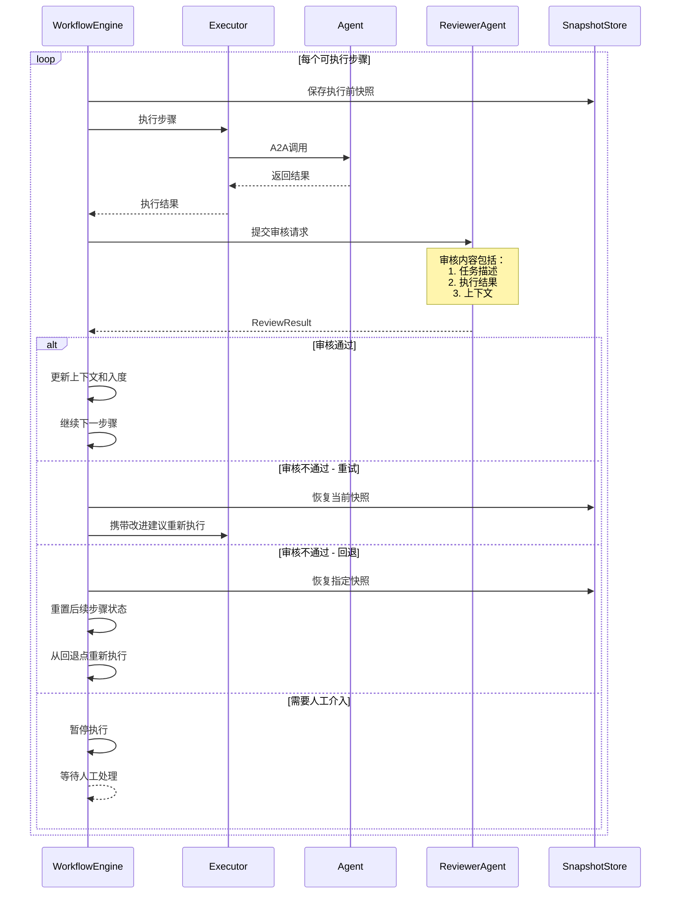

### 6.6 实现代码示例

#### 6.6.1 审核配置

```python
# src/yinqing/core/types.py 新增

class ReviewConfig(BaseModel):
    """审核配置"""
    enabled: bool = True                   # 是否启用审核
    review_all_steps: bool = False         # 是否审核所有步骤
    review_final_only: bool = True         # 只审核最终结果
    critical_steps: List[int] = []         # 关键步骤列表（必须审核）
    quality_threshold: float = 0.7         # 质量阈值
    max_retries: int = 3                   # 最大重试次数
    enable_rollback: bool = True           # 是否启用回溯

class ExecutionPlan(BaseModel):
    # ... 原有字段 ...
    review_config: ReviewConfig = ReviewConfig()
    snapshots: Dict[int, ExecutionSnapshot] = {}
```

#### 6.6.2 审核层实现

```python
# src/yinqing/core/reviewer.py

class ReviewerLayer:
    """审核层 - 负责质量检查和回溯建议"""

    def __init__(self):
        self.llm = ChatGoogleGenerativeAI(
            model="gemini-2.0-flash",
            temperature=0.1  # 低温度确保审核一致性
        )
        self.review_prompt = ChatPromptTemplate.from_messages([
            ("system", """你是一个严格的质量审核专家。你的职责是：
1. 评估任务执行结果是否满足要求
2. 检查结果的完整性、准确性和质量
3. 如果有问题，提供具体的改进建议
4. 必要时建议回溯到之前的步骤

评分标准：
- 0.9-1.0: 优秀，完全满足要求
- 0.7-0.9: 良好，基本满足要求
- 0.5-0.7: 一般，需要改进
- 0.0-0.5: 不合格，需要重做

请以JSON格式返回审核结果。"""),
            ("user", """
任务描述: {task_description}
执行结果: {result}
上下文信息: {context}

请审核以上执行结果。
""")
        ])
        self.parser = JsonOutputParser(pydantic_object=ReviewResult)
        self.chain = self.review_prompt | self.llm | self.parser

    async def review_step(
        self,
        step: TaskStep,
        result: str,
        context: Dict[str, Any]
    ) -> ReviewResult:
        """审核单个步骤的执行结果"""

        review_result = await self.chain.ainvoke({
            "task_description": step.description,
            "result": result,
            "context": json.dumps(context, ensure_ascii=False, indent=2)
        })

        # 根据评分决定是否通过
        review_result.passed = review_result.score >= 0.7

        # 如果不通过，生成回溯建议
        if not review_result.passed:
            review_result.rollback_recommendation = self._generate_rollback_action(
                step, review_result
            )

        return review_result

    def _generate_rollback_action(
        self,
        step: TaskStep,
        review: ReviewResult
    ) -> RollbackAction:
        """生成回溯动作建议"""

        if review.score >= 0.5:
            # 质量一般，重试当前步骤
            return RollbackAction(
                action_type="retry",
                target_step_id=step.step_id,
                reason=f"质量评分{review.score}未达标，建议重试",
                max_retries=3
            )
        elif review.score >= 0.3:
            # 质量较差，可能需要回退到前置步骤
            if step.dependencies:
                return RollbackAction(
                    action_type="revert",
                    target_step_id=step.dependencies[-1],
                    reason="结果质量较差，可能是前置步骤输出不佳"
                )

        # 质量很差，需要人工介入
        return RollbackAction(
            action_type="human_intervention",
            target_step_id=step.step_id,
            reason="执行结果严重不合格，需要人工检查"
        )
```

#### 6.6.3 快照管理器

```python
# src/yinqing/core/snapshot.py

class SnapshotManager:
    """执行快照管理器"""

    def __init__(self):
        self.snapshots: Dict[str, ExecutionSnapshot] = {}

    def create_snapshot(
        self,
        trace_id: str,
        step_id: int,
        context: Dict[str, Any],
        plan: ExecutionPlan
    ) -> ExecutionSnapshot:
        """创建执行快照"""

        snapshot = ExecutionSnapshot(
            snapshot_id=f"{trace_id}_{step_id}_{int(time.time())}",
            timestamp=datetime.now(),
            trace_id=trace_id,
            step_id=step_id,
            global_context=copy.deepcopy(context),
            step_states={
                s.step_id: StepState(
                    status=s.status,
                    result=s.result,
                    retry_count=getattr(s, 'retry_count', 0),
                    error_history=getattr(s, 'error_history', [])
                )
                for s in plan.steps
            },
            in_degrees={s.step_id: s.in_degree for s in plan.steps},
            completed_steps=[s.step_id for s in plan.steps if s.status == "success"]
        )

        self.snapshots[snapshot.snapshot_id] = snapshot
        return snapshot

    def restore_snapshot(
        self,
        snapshot_id: str,
        plan: ExecutionPlan
    ) -> Tuple[ExecutionPlan, Dict[str, Any]]:
        """恢复到指定快照状态"""

        snapshot = self.snapshots.get(snapshot_id)
        if not snapshot:
            raise ValueError(f"Snapshot {snapshot_id} not found")

        # 恢复上下文
        restored_context = copy.deepcopy(snapshot.global_context)

        # 恢复步骤状态
        for step in plan.steps:
            state = snapshot.step_states.get(step.step_id)
            if state:
                step.status = state.status
                step.result = state.result
                step.in_degree = snapshot.in_degrees.get(step.step_id, 0)

        return plan, restored_context

    def get_rollback_snapshot(
        self,
        trace_id: str,
        target_step_id: int
    ) -> Optional[ExecutionSnapshot]:
        """获取回溯到指定步骤的快照"""

        # 找到目标步骤执行前的最近快照
        candidates = [
            s for s in self.snapshots.values()
            if s.trace_id == trace_id and s.step_id <= target_step_id
        ]

        if not candidates:
            return None

        return max(candidates, key=lambda s: s.timestamp)
```

#### 6.6.4 改进后的WorkflowEngine

```python
# src/yinqing/core/workflow.py 改进版

class WorkflowEngine:
    """改进后的工作流引擎 - 支持审核和回溯"""

    def __init__(self):
        self.parser = TaskParserLayer()
        self.matcher = CapabilityMatcherLayer()
        self.executor = TaskExecutorLayer()
        self.reviewer = ReviewerLayer()           # 新增
        self.snapshot_manager = SnapshotManager() # 新增
        self.global_context = {}

    async def stream(
        self,
        query: str,
        context_id: str = None,
        task_id: str = None,
        review_config: ReviewConfig = None
    ):
        """主编排函数 - 支持审核和回溯"""

        # Phase 1: 任务解析
        plan = await self.parser.parse(query, context_id, task_id)
        if review_config:
            plan.review_config = review_config

        yield {"phase": "parsing", "content": f"任务已拆解为{len(plan.steps)}个步骤"}

        # Phase 2: Agent匹配
        plan = await self.matcher.match_agents(plan)
        yield {"phase": "matching", "content": "Agent匹配完成"}

        # Phase 3: DAG并行执行（带审核）
        trace_id = plan.trace_id
        queue = deque()

        # 初始化就绪队列
        for step in plan.steps:
            if step.in_degree == 0 and step.status == "pending":
                queue.append(step.step_id)

        while queue:
            current_batch = [plan.step_map[sid] for sid in queue]
            queue.clear()

            for step in current_batch:
                # 创建执行前快照
                if plan.review_config.enable_rollback:
                    self.snapshot_manager.create_snapshot(
                        trace_id, step.step_id,
                        self.global_context, plan
                    )

                # 执行步骤（带重试逻辑）
                step, result = await self._execute_with_review(
                    step, plan, trace_id
                )

                if step.status == "failed":
                    if plan.review_config.enable_rollback:
                        # 处理回溯
                        rollback_result = await self._handle_rollback(
                            step, plan, trace_id
                        )
                        if rollback_result.get("action") == "continue":
                            # 回溯成功，重新执行
                            queue.append(step.step_id)
                            continue

                    yield {
                        "phase": "error",
                        "step_id": step.step_id,
                        "content": f"步骤{step.step_id}执行失败: {step.error}"
                    }
                    continue

                # 更新上下文
                self.global_context[f"step_{step.step_id}_output"] = result

                yield {
                    "phase": "progress",
                    "step_id": step.step_id,
                    "content": f"步骤{step.step_id}完成",
                    "result": result[:200] + "..." if len(result) > 200 else result
                }

                # 更新后继步骤入度
                for succ_id in step.successors:
                    succ_step = plan.step_map[succ_id]
                    succ_step.in_degree -= 1
                    if succ_step.in_degree == 0 and succ_step.status == "pending":
                        queue.append(succ_id)

        # Phase 4: 最终审核（可选）
        if plan.review_config.review_final_only:
            final_review = await self._final_review(plan)
            yield {
                "phase": "final_review",
                "content": f"最终审核{'通过' if final_review.passed else '未通过'}",
                "score": final_review.score
            }

        # Phase 5: 结果汇总
        yield {"phase": "complete", "is_complete": True, "trace_id": trace_id}

    async def _execute_with_review(
        self,
        step: TaskStep,
        plan: ExecutionPlan,
        trace_id: str
    ) -> Tuple[TaskStep, str]:
        """执行步骤并进行审核"""

        retry_count = 0
        max_retries = plan.review_config.max_retries

        while retry_count < max_retries:
            # 执行步骤
            step, result = await self.executor.execute_step(
                step, self.global_context, trace_id
            )

            if step.status == "failed":
                retry_count += 1
                continue

            # 检查是否需要审核
            should_review = (
                plan.review_config.enabled and
                (plan.review_config.review_all_steps or
                 step.step_id in plan.review_config.critical_steps)
            )

            if should_review:
                review = await self.reviewer.review_step(
                    step, result, self.global_context
                )

                if not review.passed:
                    logger.warning(
                        f"步骤{step.step_id}审核未通过: {review.issues}"
                    )

                    # 将审核建议加入上下文供重试使用
                    self.global_context["_review_suggestions"] = review.suggestions

                    retry_count += 1
                    step.status = "pending"
                    continue

            return step, result

        # 超过重试次数
        step.status = "failed"
        step.error = f"超过最大重试次数({max_retries})"
        return step, ""

    async def _handle_rollback(
        self,
        step: TaskStep,
        plan: ExecutionPlan,
        trace_id: str
    ) -> Dict:
        """处理回溯逻辑"""

        # 获取最近的审核建议
        if hasattr(step, '_last_review') and step._last_review:
            action = step._last_review.rollback_recommendation

            if action.action_type == "revert":
                # 回退到指定步骤
                snapshot = self.snapshot_manager.get_rollback_snapshot(
                    trace_id, action.target_step_id
                )
                if snapshot:
                    plan, self.global_context = self.snapshot_manager.restore_snapshot(
                        snapshot.snapshot_id, plan
                    )
                    return {"action": "continue", "reverted_to": action.target_step_id}

            elif action.action_type == "human_intervention":
                # 需要人工介入
                return {"action": "pause", "reason": action.reason}

        return {"action": "abort"}

    async def _final_review(self, plan: ExecutionPlan) -> ReviewResult:
        """对整个执行结果进行最终审核"""

        # 收集所有成功步骤的结果
        all_results = "\n\n".join([
            f"## Step {s.step_id}: {s.name}\n{s.result}"
            for s in plan.steps if s.status == "success"
        ])

        # 创建一个虚拟步骤用于最终审核
        final_step = TaskStep(
            step_id=0,
            name="Final Result",
            description=f"完成目标: {plan.goal}",
            context_keys=[],
            dependencies=[]
        )

        return await self.reviewer.review_step(
            final_step, all_results, {"goal": plan.goal}
        )
```

### 6.7 改进后的系统架构图

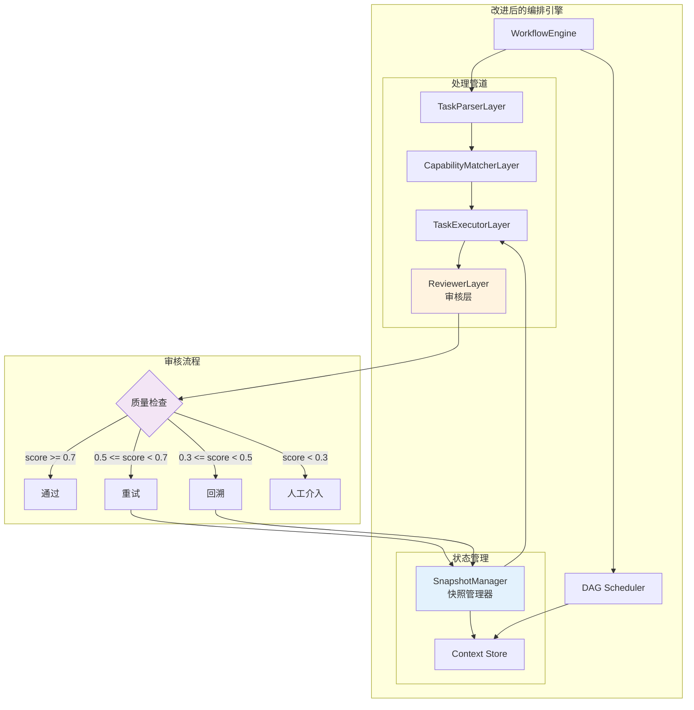

### 6.8 使用示例

```python
# 启用审核的任务执行
async def main():
    engine = WorkflowEngine()

    # 配置审核策略
    review_config = ReviewConfig(
        enabled=True,
        review_all_steps=False,      # 不审核所有步骤
        review_final_only=True,      # 审核最终结果
        critical_steps=[4],          # 步骤4是关键步骤，必须审核
        quality_threshold=0.7,       # 质量阈值
        max_retries=3,               # 最大重试3次
        enable_rollback=True         # 启用回溯
    )

    async for response in engine.stream(
        "分析Python、Java和Go的优缺点，并写一份专业的对比报告",
        review_config=review_config
    ):
        print(f"[{response['phase']}] {response.get('content', '')}")

        if response['phase'] == 'final_review':
            print(f"  质量评分: {response['score']}")
```

---

## 7. 部署与运维

### 7.1 启动顺序

```bash
# 1. 启动MCP Server
python3 real_ecosystem/mcp_server/server.py &

# 2. 启动所有Agent（包括新的审核Agent）
python3 real_ecosystem/agents/researcher.py &
python3 real_ecosystem/agents/writer.py &
python3 real_ecosystem/agents/coder.py &
python3 real_ecosystem/agents/data_analyst.py &
python3 real_ecosystem/agents/reviewer.py &
python3 real_ecosystem/agents/translator.py &
python3 real_ecosystem/agents/quality_reviewer.py &  # 新增

# 3. 等待服务就绪
sleep 5

# 4. 运行编排器
./run_local.sh "你的任务"
```

### 7.2 监控指标

```
┌─────────────────────────────────────────────────────────────┐
│                    关键监控指标                              │
├─────────────────────────────────────────────────────────────┤
│  任务成功率      │  成功任务数 / 总任务数                    │
│  平均执行时间    │  所有任务的平均耗时                       │
│  审核通过率      │  首次通过审核的步骤比例                   │
│  回溯频率        │  触发回溯的次数 / 总步骤数                │
│  Agent利用率     │  各Agent的调用次数分布                    │
│  重试率          │  需要重试的步骤比例                       │
└─────────────────────────────────────────────────────────────┘
```

### 7.3 日志格式

```
[2024-12-15 10:30:45] INFO  | trace_id=abc123 | phase=parsing | 任务已拆解为4个步骤
[2024-12-15 10:30:46] INFO  | trace_id=abc123 | phase=matching | Agent匹配完成
[2024-12-15 10:30:50] INFO  | trace_id=abc123 | step_id=1 | status=success | duration=3.2s
[2024-12-15 10:30:51] WARN  | trace_id=abc123 | step_id=2 | review=failed | score=0.65
[2024-12-15 10:30:52] INFO  | trace_id=abc123 | step_id=2 | action=retry | attempt=2
[2024-12-15 10:30:55] INFO  | trace_id=abc123 | step_id=2 | status=success | duration=2.8s
```

---

## 附录

### A. 环境变量配置

```bash
# .env
GOOGLE_API_KEY=your_api_key
MCP_SERVER_HOST=localhost
MCP_SERVER_PORT=10000
MCP_SERVER_TRANSPORT=sse

# 审核相关配置
REVIEW_ENABLED=true
REVIEW_QUALITY_THRESHOLD=0.7
REVIEW_MAX_RETRIES=3
```

### B. 依赖版本

```toml
[project]
dependencies = [
    "a2a-sdk[sql]>=0.3.0",
    "click>=8.1.8",
    "google-generativeai>=0.8.5",
    "httpx>=0.28.1",
    "langchain-google-genai>=2.0.10",
    "pydantic>=2.11.4",
    "mcp[cli]>=1.5.0",
    "rich>=13.0.0",
]
```

### C. 参考文档

- [MCP Protocol Specification](https://modelcontextprotocol.io/)
- [A2A Protocol Documentation](https://github.com/google/a2a-sdk)
- [LangChain Documentation](https://python.langchain.com/)
- [Pydantic V2 Documentation](https://docs.pydantic.dev/latest/)
