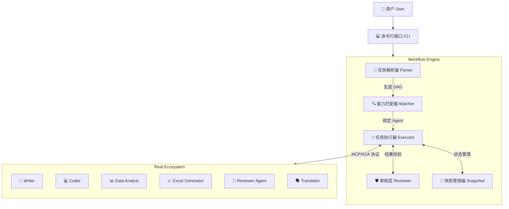
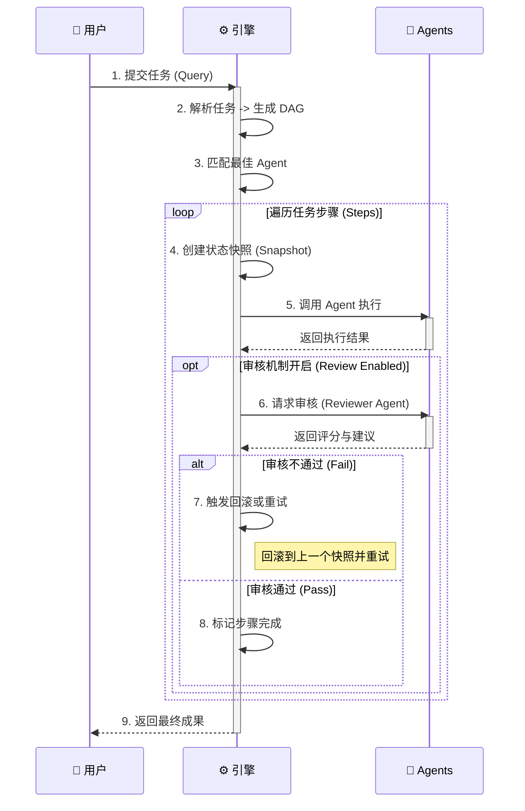

# YinQing Agent (增强版)

YinQing Agent 是一个基于 MCP (Model Context Protocol) 和 A2A (Agent to Agent) 协议的通用智能体编排框架。它旨在简化多智能体系统的构建、管理和交互，支持复杂的任务自动化。

本项目的增强版引入了质量审核 (Reviewer) 和流程回溯 (Rollback) 机制，大大提高了任务执行的可靠性和结果质量。

## 🚀 核心功能

*   **多智能体编排**: 基于 DAG (有向无环图) 的任务规划与执行。
*   **标准化协议**: 全面支持 MCP 和 A2A 协议，确保智能体之间的互操作性。
*   **🛡️ 质量审核机制**:
    *   **Reviewer Layer**: 内置审核层，可对每个步骤的执行结果进行质量评估。
    *   **智能重试**: 当结果未达标时，自动触发重试或优化。
*   **⏪ 流程回溯**:
    *   **快照管理**: 自动保存执行状态快照。
    *   **故障恢复**: 遇到不可修复的错误时，可回滚到上一个稳定状态。
*   **多种输出格式**: 支持生成 Markdown 报告、Excel 数据表、Word 文档等。
*   **灵活配置**: 支持通过环境变量和命令行参数进行精细化配置。

## 🏗️ 项目架构与流程

### 系统架构图

本系统采用分层架构设计，核心引擎负责任务的编排与状态管理，底层 Agent 生态系统提供具体的能力支持。



### 核心工作流程

任务执行遵循"解析-匹配-执行-审核"的闭环流程，确保每一步都稳健可靠。



## 📋 环境要求

*   Python >= 3.10
*   `uv` (推荐) 或 `pip`

## 🛠️ 安装与配置

### 1. 克隆项目

```bash
git clone <repository_url>
cd bianpaiqi-main3
```

### 2. 安装依赖

本项目使用 `uv` 进行包管理，推荐使用 `uv` 安装依赖：

```bash
# 安装 uv (如果尚未安装)
pip install uv

# 同步依赖
uv sync
```

或者使用传统的 `pip`：

```bash
pip install -r requirements.txt
# 注意：如果项目中只有 pyproject.toml，请使用:
pip install .
```

### 3. 配置环境变量

复制 `.env` 示例文件（如果存在）或创建一个新的 `.env` 文件，并填入必要的 API Key：

```ini
# .env 文件内容示例
OPENAI_API_KEY=sk-xxxxxxxxxxxxxxxxxxxxxxxxxxxxxxxx
OPENAI_BASE_URL=https://dashscope.aliyuncs.com/compatible-mode/v1
OPENAI_MODEL=qwen3-max
```

## 💻 使用指南

### 1. 启动 Agent 生态系统

在使用编排器之前，需要先启动底层的 Agent 服务。

```bash
./start_real_agents.sh
```

此脚本会启动 `real_ecosystem/agents` 目录下定义的所有 Agent 服务。

### 2. 运行编排器 (增强版)

使用 `run_enhanced.sh` 脚本来运行任务。支持交互模式和命令行参数模式。

#### 交互模式

直接运行脚本进入交互式命令行：

```bash
./run_enhanced.sh
```

#### 直接执行任务

```bash
./run_enhanced.sh "分析Python语言的优缺点并生成报告"
```

#### 高级选项

*   **启用/禁用审核** (默认启用):
    ```bash
    ./run_enhanced.sh --no-review "简单任务"
    ```

*   **审核所有步骤**:
    默认情况下只审核最终结果，使用 `--review-all` 可以审核每一个中间步骤：
    ```bash
    ./run_enhanced.sh --review-all "写一份详细的技术调研报告"
    ```

*   **设置质量阈值**:
    设置审核通过的最低分数 (0-1，默认为 0.7)：
    ```bash
    ./run_enhanced.sh --threshold 0.8 "高标准任务"
    ```

*   **设置最大重试次数**:
    ```bash
    ./run_enhanced.sh --max-retries 5 "复杂任务"
    ```

*   **查看帮助**:
    ```bash
    ./run_enhanced.sh --help
    ```

## 📂 项目结构

```text
bianpaiqi-main3/
├── output/                 # 任务执行生成的输出文件 (Excel, Markdown 等)
├── real_ecosystem/         # Agent 生态系统
│   ├── agents/             # Agent 具体实现 (Python 代码)
│   ├── cards/              # Agent 能力描述卡片 (JSON)
│   └── mcp_server/         # MCP 服务器实现
├── src/
│   └── yinqing/
│       ├── core/           # 核心框架代码
│       │   ├── executor.py # 任务执行器
│       │   ├── matcher.py  # 能力匹配器
│       │   ├── parser.py   # 任务解析器
│       │   ├── reviewer.py # 审核层实现
│       │   ├── snapshot.py # 快照管理器
│       │   └── workflow_enhanced.py # 增强版工作流引擎
│       ├── main_enhanced.py # 增强版入口
│       └── utils/          # 工具函数
├── pyproject.toml          # 项目依赖配置
├── run_enhanced.sh         # 增强版启动脚本
└── start_real_agents.sh    # Agent 服务启动脚本
```

## 🔧 开发指南

### 添加新的 Agent

1.  **创建 Agent 实现**: 在 `real_ecosystem/agents/` 下创建一个新的 Python 文件（参考 `writer.py`），实现 Agent 的逻辑并启动一个 HTTP 服务。
2.  **定义能力卡片**: 在 `real_ecosystem/cards/` 下创建一个对应的 JSON 文件（参考 `writer.json`），描述 Agent 的名称、功能、输入输出格式等。
3.  **注册启动**: 修改 `start_real_agents.sh`，将新的 Agent 加入启动列表。

## ⚠️ 常见问题

*   **API Key 错误**: 请检查 `.env` 文件中的 `OPENAI_API_KEY` 是否正确设置。
*   **依赖缺失**: 请确保已运行 `uv sync` 或 `pip install .` 安装所有依赖。
*   **Agent 连接失败**: 请确保已运行 `./start_real_agents.sh` 并且所有 Agent 服务都已成功启动。

---
Generated by YinQing Team
